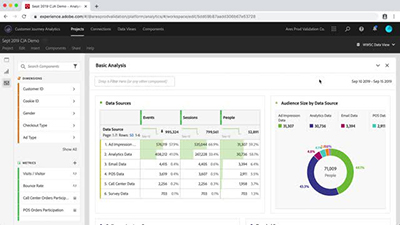
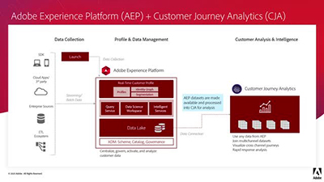
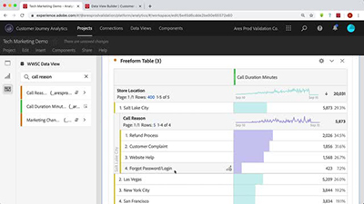

# Tutorials zu Customer Journey Analytics

Willkommen auf der Tutorial-Site zu [!DNL Customer Journey Analytics].  Durch die Verwendung dieser Tutorials zusammen mit der [Dokumentation](https://experienceleague.adobe.com/docs/analytics-platform/using/cja-landing.html?lang=de) erhalten Sie ein besseres Verständnis dafür, wie Sie mit Adobe Analytics schneller als je zuvor kanalübergreifende Kundeneinblicke gewinnen können.  Als ersten Schritt

* Die neuesten Informationen finden Sie unten im Abschnitt **Neue Funktionen**
* Die **Auswahl der Mitarbeiter** zeigt einige unserer Lieblingsinhalte
* Erkunden Sie den Inhalt sortiert nach Thema und Unterthema in der **linken Navigation**
* Verwenden Sie das Feld **Suche** oben auf der Seite, wenn Sie wissen, wonach Sie genau suchen

Mit Customer Journey Analytics können Sie steuern, wie Sie Ihre Online- und Offline-Daten in Analysis Workspace mit einer beliebigen Kunden-ID verbinden. Dies ermöglicht Ihnen schließlich die Attribution, Segmentierung, den Fluss, den Fallout usw. für Ihren gesamten Kundendatensatz.

## Auswahl der Mitarbeiter

<table>
<tr>
  <td>
    
    

      <a href="visitor-id/understanding-how-customer-journey-analytics-uses-identity.md">
    <strong>So verwendet Customer Journey Analytics Identitäten</strong>
    </a>
    

    

    <em>Praktischer Einblick in die Auswirkungen von Identitäten auf Ihre Analyse in Customer Journey Analytics</em>
    

  </td>
   <td>
    
    

      <a href="architecture/architecture-and-integrations-of-cja.md">
    <strong>Architektur und Integrationen von Customer Journey Analytics</strong>
    </a>
    

    

    <em>Informationen zur Architektur von Adobe Customer Journey Analytics, einschließlich der Integration mit Adobe Experience Platform</em>
    

  </td>
  <td>
    
    

      <a href="analysis-workspace/visualizations/cross-channel-attribution-in-customer-journey-analytics.md">
    <strong>Kanalübergreifende Attribution in Customer Journey Analytics</strong>
    </a>
    

    

    <em>Verwendung von Visualisierungen zur Anzeige der Attribution auf den Kanälen</em>
    

  </td>
</tr>
</table>

